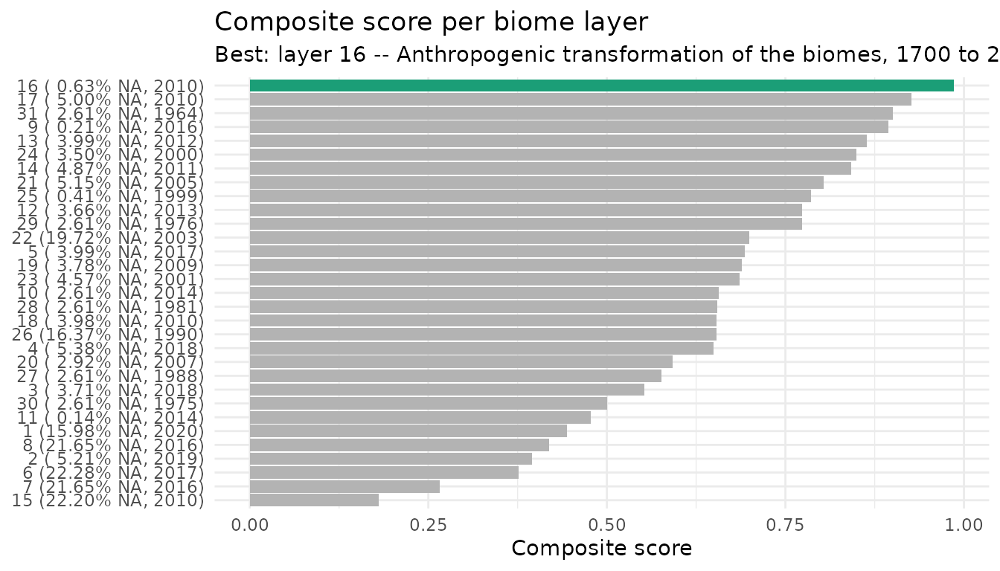
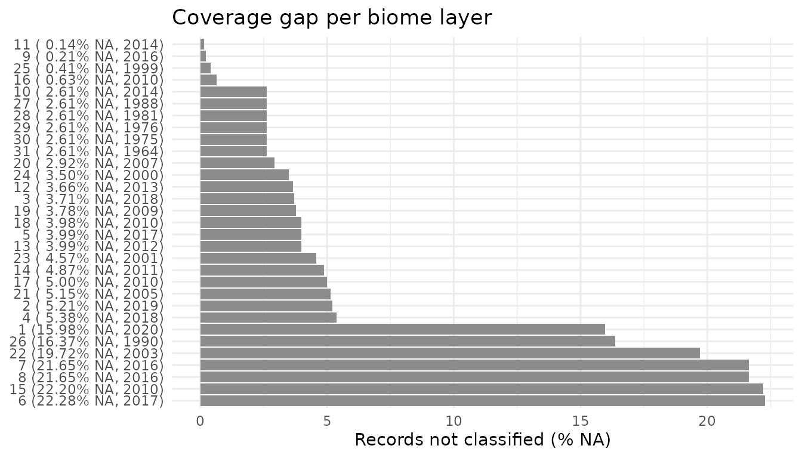
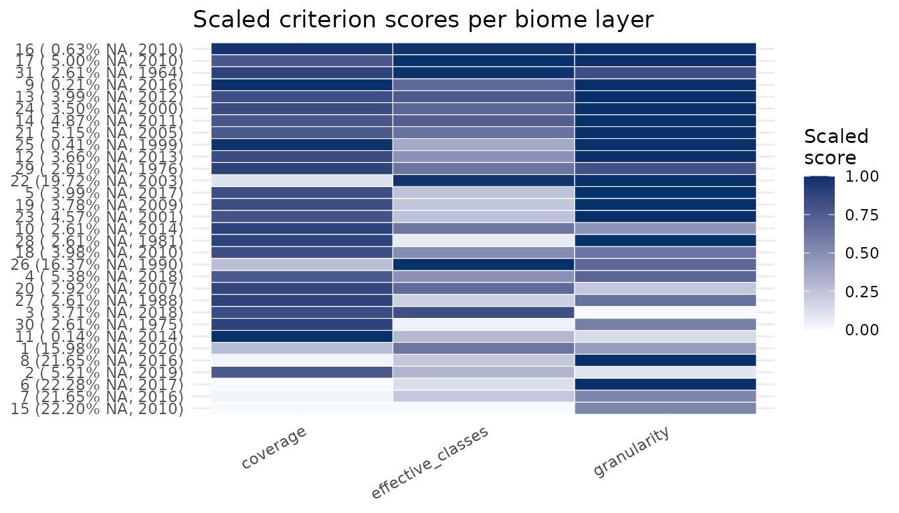

# 1. Biome layers and occurrence data

## Goal

This is the first of three vignettes that walk through the `biomes`
package:

1.  **Biome layers and occurrence data** (this vignette): the raw
    material: load the biome layers, read their metadata, get an
    occurrence dataset, and decide *which* biome definition fits your
    data best.
2.  [Classify, summarize and
    map](https://azizka.github.io/biomes/articles/classify-summarize-map.md):
    assign occurrences to biomes, tabulate them, and draw a map.
3.  [The one-call
    workflow](https://azizka.github.io/biomes/articles/one-call-workflow.md):
    do all of the above in a single
    [`biomes_full()`](https://azizka.github.io/biomes/reference/biomes_full.md)
    call.

Here we cover everything you need *before* classifying: the 31 biome
layers, their metadata, where occurrences come from, and the ranking
that suggests the most informative layer for a dataset.

------------------------------------------------------------------------

## 1. The 31 biome layers

[`biomes_get()`](https://azizka.github.io/biomes/reference/biomes_get.md)
returns the packaged raster stack: 31 biome definitions (Fischer et
al. 2022) at 10 × 10 km resolution, globally.

``` r

layers <- biomes_get()
layers
#> class       : SpatRaster
#> size        : 1800, 3600, 31  (nrow, ncol, nlyr)
#> resolution  : 10000, 10000  (x, y)
#> extent      : -1.8e+07, 1.8e+07, -9000000, 9000000  (xmin, xmax, ymin, ymax)
#> coord. ref. : +proj=moll +lon_0=0 +x_0=0 +y_0=0 +ellps=WGS84 +units=m +no_defs
#> source      : Biomes_Inventory_RasterStack.tif
#> names       : Biome~er_01, Biome~er_02, Biome~er_03, Biome~er_04, Biome~er_05, Biome~er_06, ...
#> min values  :           1,           1,           1,           1,           1,           1, ...
#> max values  :          21,          98,          30,          20,          15,          14, ...
```

It is an ordinary
[`terra::SpatRaster`](https://rspatial.github.io/terra/reference/SpatRaster-class.html),
so you can subset and plot single layers directly (`biomes` attaches
**terra** for you):

``` r

layers[[1]]
#> class       : SpatRaster
#> size        : 1800, 3600, 1  (nrow, ncol, nlyr)
#> resolution  : 10000, 10000  (x, y)
#> extent      : -1.8e+07, 1.8e+07, -9000000, 9000000  (xmin, xmax, ymin, ymax)
#> coord. ref. : +proj=moll +lon_0=0 +x_0=0 +y_0=0 +ellps=WGS84 +units=m +no_defs
#> source      : Biomes_Inventory_RasterStack.tif
#> name        : Biome_Inventory_layer_01
#> min value   :                        1
#> max value   :                       21
plot(layers[[1]])
```


------------------------------------------------------------------------

## 2. Layer metadata

Each layer of the stack matches one row of `biomes_information`, in the
same order. Use it to find out which publication and classification a
layer comes from:

``` r

data(biomes_information)
biomes_information[1, c("publication", "name_of_classification",
                        "layer_in_raster_stack")]
#> # A tibble: 1 × 3
#>   publication        name_of_classification                layer_in_raster_stack
#>   <chr>              <chr>                                                 <dbl>
#> 1 Allen et al., 2020 Global vegetation patterns of the pa…                     1
```

[`biomes_info()`](https://azizka.github.io/biomes/reference/biomes_info.md)
prints a human-readable summary for one, several, or all layers:

``` r

biomes_info(1)
#> 
#> Name: Global vegetation patterns of the past 140,000 years (Allen et al., 2020)
#> 
#> Layer in raster stack: 1
#> 
#> Criteria: Carbon mass, LAI, and plant functional types
#> 
#> Methodology: Modelling with the global dynamic vegetation Lund-Potsdam-Jena General Ecosystem Simulator
#> 
#> Description: Global biomes were simulated over the past 140,000 years. Input factors to the dynamic global vegetation model included reconstructed atmospheric CO2 concentrations, Earth's obliquity and paleo- as well as pre-industrial climate simulations by HadCM3. Biomes were assigned according to specified ranges of vegetation carbon mass and leaf area index (LAI) of functional plant types based on consistent rules.
#> 
#> Number of biomes: 21 (21/0)
#> 
#> Biome classes (raster value: name):
#>      1: Tropical evergreen forest
#>      2: Tropical raingreen forest
#>      3: Savanna
#>      4: Tropical grassland
#>      5: Warm temperate woodland
#>      6: Desert
#>      7: Temperate broadleaf evergreen forest
#>      8: Semidesert
#>      9: Temperate shrubland
#>     10: Temperate needleleaf evergreen forest
#>     11: Steppe
#>     12: Temperate parkland
#>     13: Temperate summergreen forest
#>     14: Temperate mixed forest
#>     15: Boreal parkland
#>     16: Tundra
#>     17: Boreal summergreen broadleaf forest
#>     18: Boreal evergreen needleleaf forest
#>     19: Boreal summergreen needleleaf forest
#>     20: Shrub tundra
#>     21: Boreal woodland
#> 
#> -----
biomes_info(c(1, 14, 21))
#> 
#> Name: Global vegetation patterns of the past 140,000 years (Allen et al., 2020)
#> 
#> Layer in raster stack: 1
#> 
#> Criteria: Carbon mass, LAI, and plant functional types
#> 
#> Methodology: Modelling with the global dynamic vegetation Lund-Potsdam-Jena General Ecosystem Simulator
#> 
#> Description: Global biomes were simulated over the past 140,000 years. Input factors to the dynamic global vegetation model included reconstructed atmospheric CO2 concentrations, Earth's obliquity and paleo- as well as pre-industrial climate simulations by HadCM3. Biomes were assigned according to specified ranges of vegetation carbon mass and leaf area index (LAI) of functional plant types based on consistent rules.
#> 
#> Number of biomes: 21 (21/0)
#> 
#> Biome classes (raster value: name):
#>      1: Tropical evergreen forest
#>      2: Tropical raingreen forest
#>      3: Savanna
#>      4: Tropical grassland
#>      5: Warm temperate woodland
#>      6: Desert
#>      7: Temperate broadleaf evergreen forest
#>      8: Semidesert
#>      9: Temperate shrubland
#>     10: Temperate needleleaf evergreen forest
#>     11: Steppe
#>     12: Temperate parkland
#>     13: Temperate summergreen forest
#>     14: Temperate mixed forest
#>     15: Boreal parkland
#>     16: Tundra
#>     17: Boreal summergreen broadleaf forest
#>     18: Boreal evergreen needleleaf forest
#>     19: Boreal summergreen needleleaf forest
#>     20: Shrub tundra
#>     21: Boreal woodland
#> 
#> -----
#> 
#> Name: Global Land Cover by national mapping organizations (Tateishi et al., 2011; Tateishi et al., 2014; Kobayashi et al., 2017)
#> 
#> Layer in raster stack: 14
#> 
#> Criteria: Earth's spectral surface reflectance
#> 
#> Methodology: Supervised classification of satellite imagery by MODIS based on multiple remote sensing products for reference as well as specific regional maps and expert opinion, individual unsupervised classification for certain classes, validation with stratified random sampling
#> 
#> Description: Spectral surface reflectance data derived from sevens bands of MODIS Earth observation data from 2003/2008/2013 was classified by supervised (for 14 classes) and unsupervised approaches (for six classes). Training data originated from several remote sensors including Landsat, MODIS NDVI products, Google Earth and Virtual Earth. Satellite imagery is grouped according to the Land Cover Classification System (LCCS) by the Food and Agriculture Organization of the United Nations (FAO). Copyright information of the original data set: Global Land Cover by National Mapping Organizations: GLCNMO Version 1, Geospatial Information Authority of Japan, Chiba University and Collaborating Organizations.
#> 
#> Number of biomes: 19 (18/1)
#> 
#> Biome classes (raster value: name):
#>      1: Mangrove
#>      2: Broadleaf evergreen forest
#>      3: Herbaceous with sparse tree/shrub
#>      4: Bare soil - unconsolidated (sand)
#>      5: Paddy field
#>      6: Cropland/other vegetation mosaic
#>      7: Shrub
#>      8: Broadleaf deciduous forest
#>      9: Bare soil - consolidated (gravel and rock)
#>     10: Tree open
#>     11: Wetland
#>     12: Sparse vegetation
#>     13: Cropland
#>     14: Herbaceous
#>     15: Needleleaf evergreen forest
#>     16: Mixed forest
#>     17: Needleleaf deciduous forest
#>     18: Snow and ice
#>     19: Urban
#> 
#> -----
#> 
#> Name: GLC2000: a new approach to global land cover mapping from Earth observation data (Bartholomé & Belward, 2005)
#> 
#> Layer in raster stack: 21
#> 
#> Criteria: Top-of-canopy surface reflectance
#> 
#> Methodology: Derivation of land cover maps from spectral surface reflectance at four wavelength ranges based on regionally optimized image classification procedure
#> 
#> Description: This land cover product is generated from global daily images of the year 2000 from the VEGETATION-1 sensors of the SPOT 4 satellite and other remote sensing instruments. Regionally specific continental maps were harmonized into one consistent global map.
#> 
#> Number of biomes: 21 (20/1)
#> 
#> Biome classes (raster value: name):
#>      1: Tree cover (regularly flooded fresh water)
#>      2: Tree cover (broadleaf evergreen)
#>      3: Tree cover (regularly flooded saline water)
#>      4: Tree cover (broadleaf deciduous open)
#>      5: Mosaic cropland/tree cover/other natural vegetation
#>      6: Mosaic cropland/shrub/grass
#>      7: Bare soil
#>      8: Herbaceous cover (closed-open)
#>      9: Shrub cover (closed-open deciduous)
#>     10: Cultivated and managed area
#>     11: Tree cover (broadleaf deciduous closed)
#>     12: Shrub cover (closed-open evergreen)
#>     13: Sparse herbaceous/shrub cover
#>     14: Mosaic tree cover/other natural vegetation
#>     15: Regularly flooded shrub/herbaceous cover
#>     16: Tree cover (needleleaf evergreen)
#>     17: Tree cover (mixed leaf type)
#>     18: Tree cover (burnt)
#>     19: Tree cover (needleleaf deciduous)
#>     20: Snow and ice
#>     21: Urban
#> 
#> -----
```

The class-level lookup (raster value → biome name, per layer) lives in
`biomes_legend`. You rarely call it directly;
[`biomes_classify()`](https://azizka.github.io/biomes/reference/biomes_classify.md)
and
[`biomes_visualise()`](https://azizka.github.io/biomes/reference/biomes_visualise.md)
use it internally to label biomes, but it is there if you need it:

``` r

data(biomes_legend)
head(biomes_legend)
#> # A tibble: 6 × 41
#>   layer source id_1  id_2  id_3  id_4  id_5  id_6  id_7  id_8  id_9  id_10 id_11
#>   <int> <chr>  <chr> <chr> <chr> <chr> <chr> <chr> <chr> <chr> <chr> <chr> <chr>
#> 1     1 Allen… Trop… Trop… Sava… Trop… Warm… Dese… Temp… Semi… "Tem… Temp… Step…
#> 2     2 Buchh… Clos… Open… Open… Shru… Bare… Cult… Clos… Clos… "Ope… Herb… Open…
#> 3     3 Beck … Af -… Am -… Aw -… Cwc … BSh … Cwb … Cwa … BWh … "Cfa… Csb … Dsa …
#> 4     4 Hengl… Trop… Trop… Trop… Trop… Xero… Warm… Step… Temp… "Des… Temp… Temp…
#> 5     5 Diner… Trop… Mang… Trop… Trop… Floo… Trop… Dese… Mont… "Med… Temp… Temp…
#> 6     6 Zhang… Trop… Trop… Trop… Trop… Temp… Trop… Temp… Temp… "Tem… Sub-… Frig…
#> # ℹ 28 more variables: id_12 <chr>, id_13 <chr>, id_14 <chr>, id_15 <chr>,
#> #   id_16 <chr>, id_17 <chr>, id_18 <chr>, id_19 <chr>, id_20 <chr>,
#> #   id_21 <chr>, id_22 <chr>, id_23 <chr>, id_24 <chr>, id_25 <chr>,
#> #   id_26 <chr>, id_27 <chr>, id_28 <chr>, id_29 <chr>, id_30 <chr>,
#> #   id_31 <chr>, id_32 <chr>, id_33 <chr>, id_34 <chr>, id_35 <chr>,
#> #   id_36 <chr>, id_37 <chr>, id_38 <chr>, id_39 <chr>
```

------------------------------------------------------------------------

## 3. Occurrence data

Every downstream function works on a table of occurrence records with a
longitude and a latitude column. The package ships a small example set,
`biomes_example`, so you can try everything without a download:

``` r

data(biomes_example)
nrow(biomes_example)
#> [1] 29104
head(biomes_example)
#> # A tibble: 6 × 5
#>   genus    species          countryCode decimalLongitude decimalLatitude
#>   <chr>    <chr>            <chr>                  <dbl>           <dbl>
#> 1 Felis    Felis catus      US                     -74.6           40.6 
#> 2 Felis    Felis catus      US                     -74.6           40.6 
#> 3 Acinonyx Acinonyx jubatus KE                      35.5           -1.23
#> 4 Lynx     Lynx rufus       US                    -111.            32.3 
#> 5 Lynx     Lynx rufus       US                     -81.6           38.4 
#> 6 Panthera Panthera leo     KE                      35.4           -1.37
```

### Fetching occurrences from GBIF (optional)

If you do not already have a dataset,
[`biomes_occ()`](https://azizka.github.io/biomes/reference/biomes_occ.md)
can pull one from GBIF for a taxon (species, genus, family, …) and run
basic coordinate cleaning. It asks GBIF how many records exist and, for
up to 100,000, downloads them via `occ_search()` (no login). This is a
convenience add-on; the rest of the package works on *any* occurrence
table.

``` r

occ <- biomes_occ(taxon = "Fagus sylvatica")
```

The result has the same shape as `biomes_example` (a `family`, `genus`,
`species`, `countryCode`, `decimalLongitude`, `decimalLatitude` table by
default), so it drops straight into the next steps.

------------------------------------------------------------------------

## 4. Which biome definition fits my data?

With 31 schemes to choose from,
[`biomes_rank()`](https://azizka.github.io/biomes/reference/biomes_rank.md)
scores them for *your* occurrences and proposes a single best layer. It
rates each layer on coverage (share of records classified), the
effective number of biome classes, and granularity, then combines these
into a composite score.

``` r

r       <- biomes_rank(biomes_example, verbose = FALSE)
best_id <- attr(r, "best_layer")
best_id
#> [1] 16
head(r)
#>   layer
#> 1     1
#> 2     2
#> 3     3
#> 4     4
#> 5     5
#> 6     6
#>                                                                                                                   layer_name
#> 1                                                                       Global vegetation patterns of the past 140,000 years
#> 2                                                  Dataset of the global component of the Copernicus Land Monitoring Service
#> 3                                            Present and future Köppen-Geiger climate classification maps at 1-km resolution
#> 4 Global mapping of potential natural vegetation: an assessment of machine learning algorithms for estimating land potential
#> 5                                                       An ecoregion-based approach to protecting half the terrestrial realm
#> 6                                              A global classification of vegetation based on NDVI, rainfall and temperature
#>   year n_total n_hit n_na pct_na coverage_raw coverage_scaled
#> 1 2020   29104 24452 4652  15.98    0.8401594       0.2844065
#> 2 2019   29104 27587 1517   5.21    0.9478766       0.7708301
#> 3 2018   29104 28023 1081   3.71    0.9628573       0.8384794
#> 4 2018   29104 27538 1566   5.38    0.9461930       0.7632273
#> 5 2017   29104 27943 1161   3.99    0.9601086       0.8260667
#> 6 2017   29104 22619 6485  22.28    0.7771784       0.0000000
#>   effective_classes_raw effective_classes_scaled granularity_raw
#> 1             10.080182                0.6202006       0.9047619
#> 2              7.637310                0.3138203       0.8500000
#> 3             11.659664                0.8182963       0.8333333
#> 4              9.012508                0.4862950       0.9500000
#> 5              7.159880                0.2539420       1.0000000
#> 6              6.163172                0.1289367       1.0000000
#>   granularity_scaled composite_score rank is_best
#> 1          0.4285714       0.4443928   26   FALSE
#> 2          0.1000000       0.3948835   28   FALSE
#> 3          0.0000000       0.5522586   23   FALSE
#> 4          0.7000000       0.6498408   20   FALSE
#> 5          1.0000000       0.6933362   13   FALSE
#> 6          1.0000000       0.3763122   29   FALSE
```

[`biomes_show_rank()`](https://azizka.github.io/biomes/reference/biomes_show_rank.md)
visualizes the ranking from three angles:

``` r

biomes_show_rank(r, type = "composite")   # composite score per layer
```



``` r

biomes_show_rank(r, type = "na")          # % unclassified per layer
```



``` r

biomes_show_rank(r, type = "criteria")    # heatmap of all criteria
```



The integer in `attr(r, "best_layer")` is exactly the `layer` index you
pass to the classification and mapping functions in the next vignette.

------------------------------------------------------------------------

## Next

You now have (a) the biome layers and their metadata, (b) an occurrence
dataset, and (c) a recommended layer. Continue with [Classify, summarize
and
map](https://azizka.github.io/biomes/articles/classify-summarize-map.md)
to turn this into a biome table and a map.
