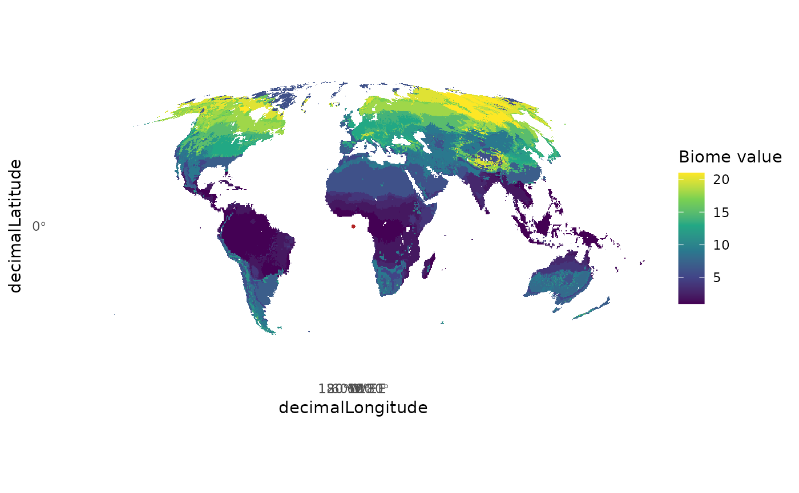

# Publication-level maps

``` r

library(biomes)
#> Loading required package: terra
#> terra 1.9.27
library(ggplot2)
library(terra)
library(tidyterra)
#> 
#> Attaching package: 'tidyterra'
#> The following object is masked from 'package:stats':
#> 
#>     filter
```

## Publication-quality maps of occurrences over biomes

Combine a biome raster with your occurrence points to produce a
publication-ready map. Below we use layer 1 (Allen et al., 2020) as the
background and overlay the `biomes_example` dataset.

``` r

data(biomes_example)
layers <- biomes_get()
biome  <- layers[[1]]

ggplot() +
  geom_spatraster(data = biome) +
  scale_fill_viridis_c(name = "Biome value", na.value = "white") +
  geom_point(data  = biomes_example,
             aes(x = decimalLongitude,
                 y = decimalLatitude),
             color = "firebrick",
             size  = 0.4,
             alpha = 0.5) +
  coord_sf(expand = FALSE) +
  theme_minimal() +
  theme(panel.grid = element_blank())
#> <SpatRaster> resampled to 5e+05 cells.
```



To save the figure at publication resolution:

``` r

ggsave("biome_map.png", width = 8, height = 4, dpi = 300)
```
