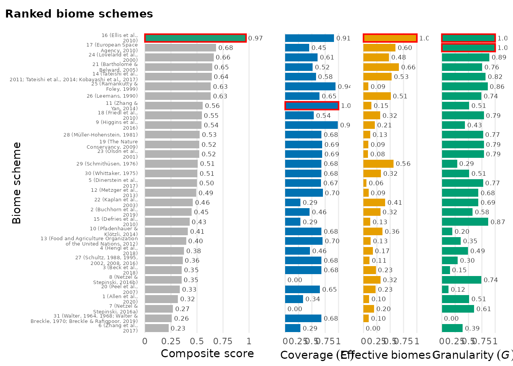

# Step 2: Choice of a biome scheme

## Goal

[Step
1](https://azizka.github.io/biomes/articles/step1-assembly-of-occurrence-records-and-biome-schemes.md)
gave us occurrence records and the 31 biome schemes. With 31 schemes to
choose from, this step picks the one that best fits *your* data, so the
choice is explicit and reproducible rather than defaulting to a familiar
scheme.

> **Terms.** A **biome scheme** is one of the 31 classification systems;
> a **biome** is a category within it; a **biome scheme number** (1-31)
> identifies a scheme. A **biome definition** is the concept on which a
> scheme delimits its biomes; the `definition` argument restricts the
> ranking to the schemes sharing one definition.

------------------------------------------------------------------------

## 1. Rank the schemes for your data

[`biomes_rank()`](https://azizka.github.io/biomes/reference/biomes_rank.md)
scores every scheme for your occurrences and proposes a single
best-fitting scheme. Each scheme is rated on three complementary,
data-driven criteria:

- **coverage**: share of records that fall on a defined biome.
- **effective number of biomes**: `exp(H')`, the effective number of
  biomes the records occupy (rewards schemes that spread the data over
  several well-populated biomes).
- **granularity**: occupied biomes divided by the total number of biomes
  in the scheme.

The three criteria are min-max scaled to `[0, 1]` across the compared
schemes and averaged (equal weights) into a **composite score**. The
best-scoring scheme is returned in `attr(ranking, "best_scheme")`.

Because the scaling is relative to the compared schemes, a composite
score is only comparable among schemes that were ranked together, and a
scaled value of 0 means “lowest among the compared schemes”, not zero. A
criterion that does not vary among the compared schemes is left out of
the composite (see `attr(ranking, "criteria_used")`), and a single
compared scheme gets no composite score. Ties in the composite score are
broken by the publication year of the scheme (more recent first; see
`tiebreaker`).

``` r

ranking <- biomes_rank(bombacoideae_occurrences, verbose = FALSE)
best    <- attr(ranking, "best_scheme")
best
#> [1] 16
head(ranking)
#>   scheme
#> 1      1
#> 2      2
#> 3      3
#> 4      4
#> 5      5
#> 6      6
#>                                                                                                                  scheme_name
#> 1                                                                       Global vegetation patterns of the past 140,000 years
#> 2                                                  Dataset of the global component of the Copernicus Land Monitoring Service
#> 3                                            Present and future Köppen-Geiger climate classification maps at 1-km resolution
#> 4 Global mapping of potential natural vegetation: an assessment of machine learning algorithms for estimating land potential
#> 5                                                       An ecoregion-based approach to protecting half the terrestrial realm
#> 6                                              A global classification of vegetation based on NDVI, rainfall and temperature
#>   year n_total n_hit n_na pct_na coverage_raw coverage_scaled
#> 1 2020   17030 15999 1031   6.05    0.9394598       0.3369938
#> 2 2019   17030 16175  855   5.02    0.9497945       0.4577900
#> 3 2018   17030 16497  533   3.13    0.9687023       0.6787920
#> 4 2018   17030 16183  847   4.97    0.9502642       0.4632807
#> 5 2017   17030 16488  542   3.18    0.9681738       0.6726150
#> 6 2017   17030 15928 1102   6.47    0.9352907       0.2882636
#>   effective_biomes_raw effective_biomes_scaled granularity_raw
#> 1             4.721102              0.10251879       0.7142857
#> 2             6.556205              0.31649699       0.7500000
#> 3             5.818907              0.23052595       0.5000000
#> 4             5.324543              0.17288175       0.7000000
#> 5             4.329130              0.05681376       0.8666667
#> 6             3.841888              0.00000000       0.6428571
#>   granularity_scaled composite_score rank is_best
#> 1          0.5142857       0.3179328   28   FALSE
#> 2          0.5750000       0.4497623   19   FALSE
#> 3          0.1500000       0.3531060   25   FALSE
#> 4          0.4900000       0.3753875   23   FALSE
#> 5          0.7733333       0.5009207   16   FALSE
#> 6          0.3928571       0.2270402   31   FALSE
```

The result is a data frame with one row per scheme; the key columns are
`scheme` (the biome scheme number), `scheme_name`, `composite_score` and
`is_best`.

#### Rank within one biome definition

Comparing schemes built on different biome definitions can mislead, so
restrict the ranking to the schemes sharing one definition with
`definition`:

``` r

r_veg <- biomes_rank(bombacoideae_occurrences, definition = "vegetation", verbose = FALSE)
attr(r_veg, "best_scheme")
#> [1] 25

table(biomes_information$biome_definition)   # how many schemes per group
#> 
#> anthropogenic       climate     ecoregion   integrative    land_cover 
#>             1             7             4             6             7 
#>    vegetation 
#>             6
```

`definition = "all"` (the default) ranks all 31 schemes. The biome
definitions are `"climate"`, `"vegetation"`, `"land_cover"`,
`"ecoregion"`, `"integrative"` and `"anthropogenic"`.

------------------------------------------------------------------------

## 2. Inspect the ranking

The `rank` panel of
[`biomes_visualise()`](https://azizka.github.io/biomes/reference/biomes_visualise.md)
shows the composite score per scheme with the best scheme highlighted:

``` r

biomes_visualise(bombacoideae_occurrences, panels = "rank")
```



Treat the ranking as a **shortlist**, not an authoritative answer: the
most suitable scheme ultimately depends on your research question.
Inspect the criterion-specific columns of the ranking and use
[`biomes_info()`](https://azizka.github.io/biomes/reference/biomes_info.md)
to pick the scheme whose concept and resolution match your data.

The integer in `attr(ranking, "best_scheme")` is exactly the biome
scheme number you pass as `scheme` to the classification and
visualisation functions next.

------------------------------------------------------------------------

## Next

You have a chosen biome scheme. Continue with [Step 3:
Occurrences-to-biome
classification](https://azizka.github.io/biomes/articles/step3-occurrence-to-biome-classification.md).
